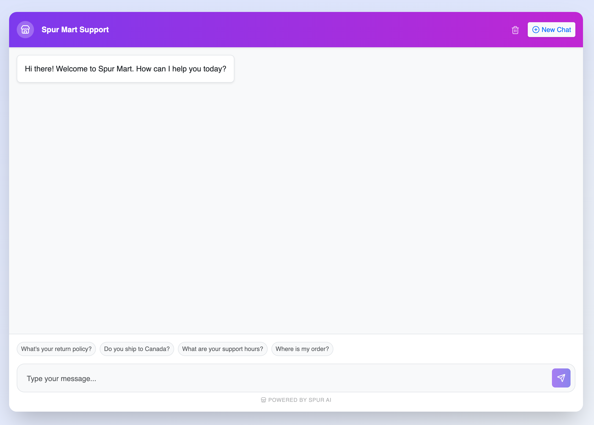

# Spur AI Live Chat Agent



A full-stack AI customer support widget built with Node.js, TypeScript, React, and SQLite.

## Features
- **Live Chat UI**: Real-time optimistic UI, auto-scrolling, typing indicators.
- **AI Integration**: Powered by OpenAI (gpt-3.5-turbo) with context-aware responses.
- **Persistence**: Conversations and messages are saved to a local SQLite database using Prisma.
- **Robustness**: 
    - Handles network errors gracefully.
    - Validates inputs.
    - Knowledge base seeded in system prompt (Shipping, Returns, etc).

## Architecture
- **Backend**: Node.js (Express) + TypeScript.
    - `src/controllers`: Request handlers.
    - `src/services`: Business logic (OpenAI wrapper).
    - `src/lib/prisma.ts`: Database client singleton.
- **Frontend**: React + Vite + TypeScript.
    - `src/components/Chat.tsx`: Main chat logic and UI.
    - Uses `axios` for API calls and `Bootstrap` for styling.
- **Database**: SQLite (via Prisma ORM). Easy to setup, no Docker required.

## Detailed Setup Instructions

Follow these steps to set up the project from scratch.

### Prerequisites
- Node.js (v18 or higher)
- npm
- OpenAI API Key

### 1. Backend Setup

1. **Navigate to the server directory:**
   ```bash
   cd server
   ```

2. **Install dependencies:**
   ```bash
   npm install
   ```

3. **Configure Environment Variables:**
   - Ensure a `.env` file exists in the `server` directory.
   - Add your OpenAI API Key:
     ```env
     OPENAI_API_KEY=your_api_key_here
     ```
   - (Optional) Configure other variables if needed (e.g., `PORT`).

4. **Initialize the Database:**
   This will create the SQLite database file and apply the schema.
   ```bash
   npx prisma generate
   npx prisma migrate dev --name init
   ```

5. **Start the Server:**
   ```bash
   npm run dev
   ```
   The server will start on `http://localhost:3001`.

### 2. Frontend Setup

1. **Open a new terminal and navigate to the client directory:**
   ```bash
   cd client
   ```

2. **Install dependencies:**
   ```bash
   npm install
   ```

3. **Start the Development Server:**
   ```bash
   npm run dev
   ```
   Access the application at `http://localhost:5173`.

### 3. Usage
- Open `http://localhost:5173`.
- Type a message (e.g., "Do you ship to Canada?").
- The AI will respond based on the store policies defined in `server/src/services/llm.service.ts`.

## Trade-offs & Future Improvements
- **Security**: No authentication is implemented strictly (open public chat). In production, `sessionId` would be tied to a logged-in user or signed JWT.
- **Scalability**: SQLite is great for dev, but Postgres would be better for high concurrency.
- **Knowledge Base**: Instead of passing the setup prompt in every request, moving store policies to a centralized knowledge-based model (RAG) would reduce token usage and allow for much larger documentation sets.
- **Context**: Currently sends last 10 messages. For long conversations, a summarization strategy or sliding window would be more efficient.
- **Chat History**: While session persistence is implemented, adding a list of previous chat sessions for users to browse is a planned enhancement.
